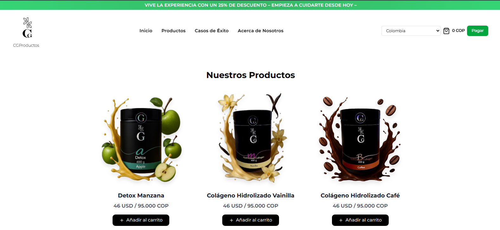

# 🛍️ CG Productos




Proyecto **CG Productos**, una tienda minimalista con carrito de compras y soporte para modo claro/oscuro.

---

## 🚀 Tecnologías utilizadas

- ⚡ [Next.js 15](https://nextjs.org/) – Framework React para el frontend
- 🎨 [Tailwind CSS](https://tailwindcss.com/) – Estilos rápidos y responsivos
- 🛠️ [TypeScript](https://www.typescriptlang.org/) – Tipado estático para mayor seguridad
- 🛒 [Shadcn/UI](https://ui.shadcn.com/) – Componentes de interfaz reutilizables
- 🌙 [Lucide Icons](https://lucide.dev/) – Íconos modernos y minimalistas
- 🔄 [Epayco](https://epayco.co/) – Pasarela de pagos integrada

---

## 📦 Instalación y uso

```bash
# Clonar el repositorio
git clone https://github.com/brikpaul569-cmd/cgProductos.git

# Entrar al directorio
cd cgproductos

# Instalar dependencias
npm install

# Ejecutar en modo desarrollo
npm run dev
